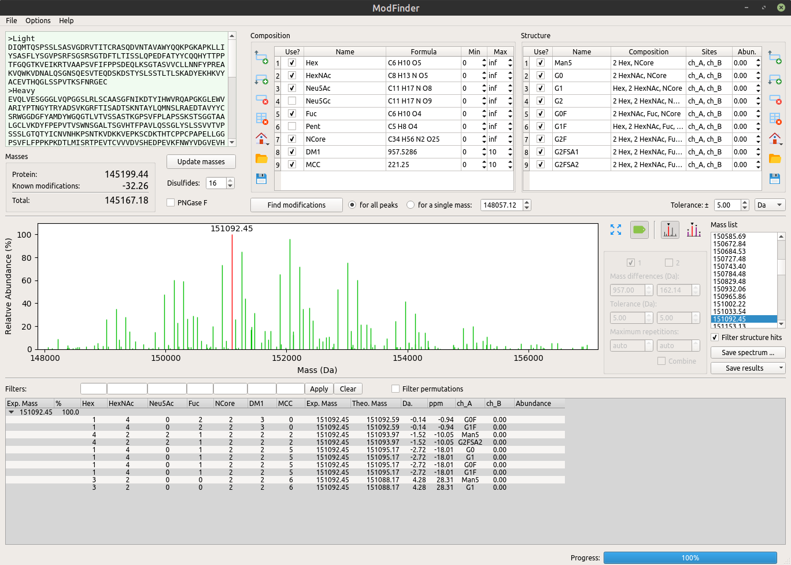

************
Introduction
************

ModFinder (MoFi) allows you to find modifications in deconvoluted mass spectra of intact proteins. The program annotates such spectra by performing a two-stage search. The first search stage, termed the composition search, returns a combination of modifications for each peak. A typical result would be "the residual mass of 3054.58 Da can be explained by one hexose, four N-acetyl hexosamines, two fucoses and two N-cores". The second search stage, termed the structure search, reduces the large number of alternative compositions typically found during the first stage by integrating bottom-up MS data in the form of a glycan library. A typical result of this stage would be "the combination above can be explained by a G0F glycan on chain A and a G1F glycan on chain B".

