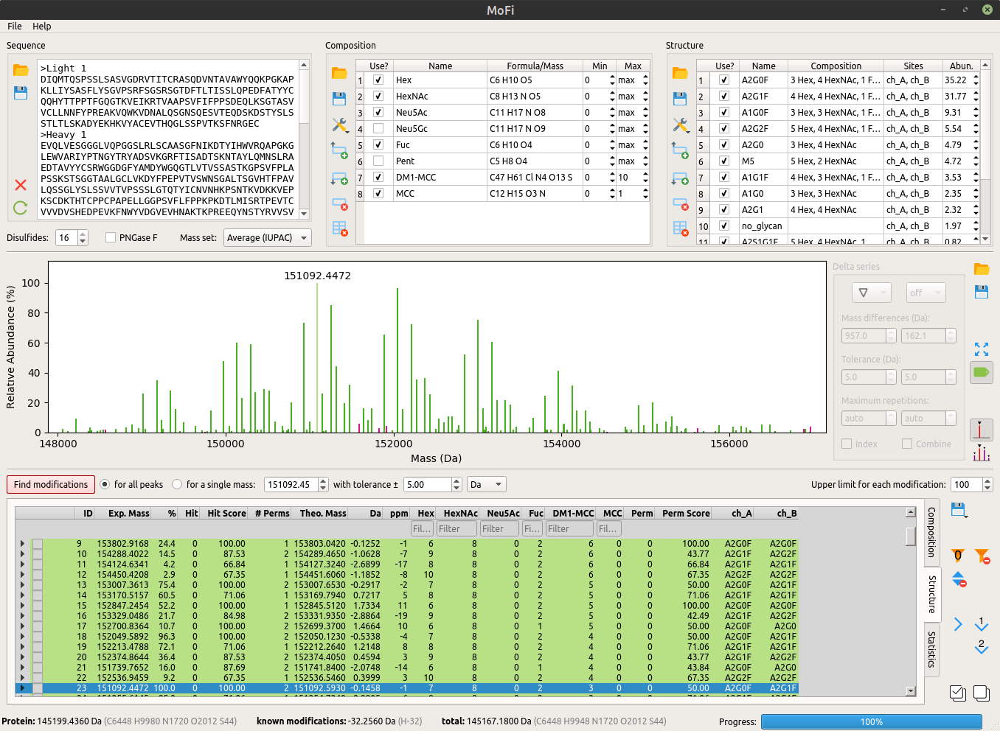

************
Introduction
************

ModFinder (MoFi) allows you to find modifications in deconvoluted mass spectra of intact proteins. The program annotates such spectra by performing a two-stage search.

The first search stage, termed the *composition search*, returns a combination of modifications for each peak. A typical result would be

  The residual mass of 3052.93 Da can be explained by the mass of seven hexoses, eight N-acetyl hexosamines, and two fucoses.

The second search stage, termed the *structure search*, reduces the large number of alternative compositions typically found during the first stage by integrating bottom-up MS data in the form of a glycan library. A typical result of this stage would be

  The combination above can be explained by a G0F glycan on chain A and a G1F glycan on chain B.

============
Getting help
============

.. image:: images/menu_help.png
           :alt: Help menu
           :align: center

ModFinder provides context-sensitive help: You may open the relevant section of this manual by

* pressing F1 while you enter values via the keybord or
* entering context help mode (*Help → What is …* or Shift+F1) and then clicking on any widget.

.. admonition:: Example
   :class: note
   
   This help file also includes a step-by-step tutorial denoted by *Example* boxes like this ones.
   In this tutorial, you will annotate a mass spectrum of Kadcyla (ado-trastuzumab emtansine),
   an antibody-drug conjugate used in treatment of HER2-positive metastatic breast cancer.
   The folder ``sample data`` contains the required data files:
   
   :``0_settings.xml``: ModFinder settings     
   :``1_kadcyla.fasta``: sequence of trastuzumab in FASTA format
   :``2_modifications.csv``: chemical modifications found in the drug
   :``3_glycan_library.csv``: N-glycans determined by peptide mapping
   :``3_glycan_library_BPF.csv``: the same N-glycan library as exported from Thermo BioPharma Finder
   :``4_spectrum.xls``: mass spectrum as exported from Thermo BioPharma Finder
   :``4_spectrum.csv``: the same mass spectrum in comma-separated value format
