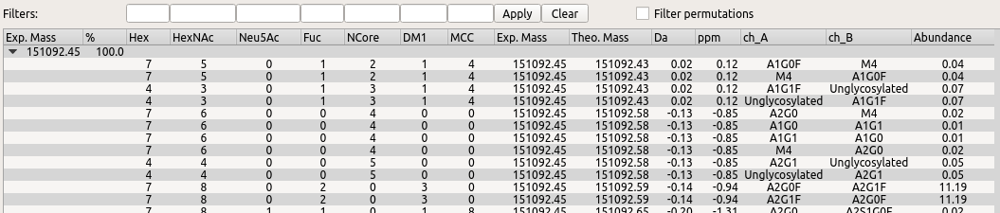
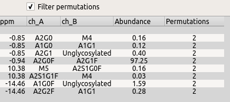
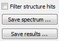

*******
Results
*******

========
Spectrum
========

After MoFi has finished the search for modifications, the spectrum gives an overview of the search results:

.. image:: images/results_spectrum.png
           :alt: Spectrum after combinatorial search
           :align: center

The peaks are colored according to the number of found annotations and selection status:

+-------------------+-----------------------+
|                   | **Annotations found** |
+-------------------+--------+--------------+
| **Peak selected** | *no*   | *yes*        |
+-------------------+--------+--------------+
| *no*              | black  | green        |
+-------------------+--------+--------------+
| *yes*             | yellow | red          |
+-------------------+--------+--------------+

=============
Results table
=============

Search results for selected peaks are shown in the table at the bottom.

For each peak, the parent row shows its experimental mass and relative abundance (%). A child row appears for each possible annotation. A composition search (stage 1) yields the following columns:

* counts for each modification (here: columns *Hex* to *MCC*)
* experimental mass (i.e., the mass detected in the spectrum)
* theoretical mass (i.e., the mass calculated for the current annotation)
* residual unexplained mass in *Da* and *ppm*

In addition, a structure search (stage 2) yields the following columns:

* glycan combination (one column per site; here: *ch_A* and *ch_B*)
* overall abundance calculated for this combination from the relative abundances of the glycans

The button *Show stage 2 results* toggles between the results from the composition and structure search to be displayed in the table. (The button text changes accordingly.) You may only display the former results if you select a single peak. However, you may export those results for all peaks (see below).

=======
Filters
=======

You may filter the results by entering a *constraint* for one or several modifications above the table and then pressing *Enter* or clicking *Apply*. The button *Clear* removes all constraints.

Constraints may have one of the following forms:

* ``N`` selects rows with exactly ``N`` modifications.
* ``L-`` selects rows with at least ``L`` modifications.
* ``L-U`` selects rows with at least ``L`` and at most ``U`` modifications.
* ``-U`` selects rows with at most ``U`` modifications.

.. image:: images/filter.png
           :alt: Results filter
           :align: center

You may also filter *permutations* of glycan combinations. Here, permutations are annotations with equal masses that comprise an equal set of glycans, but assign those glycans to different glycosylation sites. For instance, the annotations "G0F at site A, G1F at site B" and "G1F at site A, G0F at site B" are considered permutations of the glycan set G0F, G1F.

Checking the box *Filter permutations* drops permutations from the results table. In addition, MoFi adds a column *Permutations* that lists the counts for each glycan set.

==============
Saving results
==============

The spectrum can be saved in PNG/SVG format (button *Save spectrum …*).

The search results can be saved in CSV format (button *Save results*). You may choose which results should be saved in the menu that appears after clicking the button:

from composition search (stage 1) …
  saves results for all peaks from the first search stage

from structure search (stage 2) …
  saves results for all peaks from the second search stage

from structure search (permutations removed) …
  saves results for all peaks from the second search stage, but removes permutations and calculates permutation counts

as shown in table …
  saves results that are currently displayed in the table (including filters)

