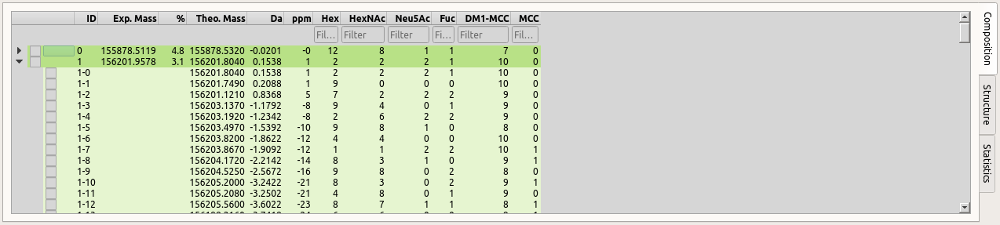

.. |bt_expand_all| image:: ../images/Expand2.png
                           :scale: 50 %
.. |bt_filter_unannotated| image:: ../images/FilterUnannotated.png
                                   :scale: 50 %
.. |bt_save| image:: ../images/Save.png
                     :scale: 50 %
.. |bt_uncheck_all| image:: ../images/UncheckAll.png
                            :scale: 50 %

*******
Results
*******

========
Spectrum
========

After MoFi has finished the search for modifications, the spectrum gives an overview of the search results:

.. image:: images/results_spectrum.png
           :alt: Spectrum after combinatorial search
           :align: center

The color of each peak indicates whether this peak is selected (lightness) and if MoFi was able to annotate it (hue). Hue derives from the search stage whose results are currently visible. Hence, click on the “Structure” (“Composition”) tab to quickly identify peaks for which MoFi found at least one annotation during structure (composition) search.

.. image:: images/colortable_spectrum.png
           :alt: Spectrum color scheme
           :align: center

==============
Results tables
==============

The hierarchical tables at the bottom of the main window display results of both search stages and overall search statistics. Switch between the tables by clicking the tabs to their right. The results tables share the following color scheme:

.. _stage-1-results:

---------------
Stage 1 results
---------------

For each peak, the parent row (dark green) shows its experimental mass (i.e., the mass detected in the spectrum), relative abundance (%), and data of the annotation with the least (absolute) unexplained mass. The format of the row index is ``[peak ID]``.

A child row (light green) with the following columns appears for each possible annotation:

* theoretical mass (i.e., the mass calculated for the current annotation)
* residual unexplained mass in *Da* and *ppm*
* counts for each modification (here: columns *Hex* to *MCC*)

For child rows, the format of the row index is ``[peak ID]-[stage 1 ID]``.

.. _stage-2-results:

---------------
Stage 2 results
---------------

.. image:: images/results_table_2.png
           :alt: Results table for search stage 2
           :align: center

For each peak, the parent row (dark green) shows its experimental mass, relative abundance (%), and data of the annotation with the highest hit score. The format of the row index is ``[peak ID]``.

A child row (light green) with the following columns appears for each possible stage 2 hit:

* hit index
* hit score (in percent)
* number of permutations
* theoretical mass
* residual unexplained mass in *Da* and *ppm*
* counts for each modification (here: columns *Hex* to *MCC*)
* data of the permutation with the highest permutation score

For child rows, the format of the row index is ``[peak ID]-[stage 1 ID]-[hit ID]``.

Each stage 2 *hit* comprises all annotations that agree in their glycan set, but assign those glycans to different glycosylation sites. These groups of isobaric annotations are called *permutations*. For instance, a hit with glycan set (A2G0F, A2G1F) may comprise the assignments "A2G0F to site A, A2G1F to site B" and "A2G1F to site A, A2G0F to site B".

A grandchild row (white) with the following columns appears for each possible permutation:

* permutation index
* permutation score (in percent)
* one column per glycosylation site (here: *ch_A* and *ch_B*)

For grandchild rows, the format of the row index is ``[peak ID]-[stage 1 ID]-[hit ID]-[permutation ID]``.

The *permutation score* is proportional to the probability of a glycan combination in a peak. Assume that a protein has :math:`a = 1, \dots, A` different glycosylation sites, each of which may harbor a single glycan from a site-specific set of glycans :math:`\Gamma_a`. (Note that :math:`\Gamma_a` has to include a "null glycan" if site :math:`a` may exist in an unglycosylated form.) Assume further that MoFi found :math:`K` permutations for a peak, and that the :math:`k`-th permutation contains the combination :math:`\gamma_k = (g_1, \dots, g_A)` of glycans :math:`g_1 \in \Gamma_1, \dots, g_A \in \Gamma_A` with known abundances :math:`p_{g_1}, \dots, p_{g_A}`. Then, the permutation score :math:`S^\mathrm{perm}_k` of the :math:`k`-th permutation is

.. math::

   S^\mathrm{perm}_k = \frac{\prod_{g \in \gamma_k} p_g}{\sum_{k=1}^K \prod_{g \in \gamma_k} p_g } \ .

The *hit score* is the sum of the scores of all permutations in a hit. Assume that MoFi found :math:`H` hits for a peak, and that the :math:`h`-th hit comprises a set of permutations :math:`\kappa_h \subseteq \{1, \dots, K\}`. Then, the hit score :math:`S^\mathrm{hit}_h` of the :math:`h`-th hit is

.. math::

   S^\mathrm{hit}_h = \sum_{k \in \kappa_h} S^\mathrm{perm}_k \ .

.. _statistics:

----------
Statistics
----------

.. image:: images/statistics_table.png
           :alt: Search statistics
           :align: center

The statistics table lists the following measures for each peak:

* search space size
* number of annotations found in the composition search
* number of permutations found in the structure search
* number of hits found in the structure search

==================================
Manipulation of the results tables
==================================

.. _sort-results:

--------
Sorting
--------

Click on a column header to sort the table by this column. The button |bt_restore_sort| *Restore original sort order* sorts the rows (1) ascending by peak ID and (2)

* ascending by absolute residual unexplained mass for stage 1 results
* descending by hit score for stage 2 results

.. _filter-results:

---------
Filtering
---------

You may filter the stage 1/2 results tables by entering a *constraint* for one or several modifications into the filters beneath the table header and then pressing *Enter*. The button |bt_clear_filters| *Clear filters* removes all constraints.

Constraints must have one of the following forms:

* ``N`` selects rows with exactly ``N`` modifications.
* ``L-`` selects rows with at least ``L`` modifications.
* ``L-U`` selects rows with at least ``L`` and at most ``U`` modifications.
* ``-U`` selects rows with at most ``U`` modifications.

.. image:: images/filter.png
           :alt: Results filter
           :align: center

|bt_filter_unannotated| *Only show unannotated* hides all parent rows with at least one annotation.

.. _expand-results:

---------
Expanding
---------

Click on the triangle to the left of any row with children to expand this row. Alternatively, use one of the following buttons to the right of the table:

* |bt_collapse_all| *Collapse all* collapses all rows.
* |bt_expand_parents| *Expand parent items* expands all peak rows, leaving the hit rows collapsed.
* |bt_expand_all| *Expand all* expands all peak and hit rows.

.. _save-results:

==============
Saving results
==============

Click |bt_save| *Save results* to save the currently visible table in CSV or XLSX format.

The stage 1/2 results tables support the following saving options:

* *Save all entries* saves all rows in the table.
* *Save checked entries* saves rows whose checkbox is fully checked.
* *Save checked entries with parents* saves rows whose checkbox is at least partially checked.

Click |bt_check_all| *Check all* or |bt_uncheck_all| *Uncheck all* to check or uncheck all rows in the currently visible table.

.. admonition:: Example
   :class: note

   Check the box of permutation 23-0-0-1. Its parent rows (23-0-0 and 23) automatically become partially checked:

   .. image:: images/results_table_checkboxes.png
              :alt: Results table checkboxes
              :align: center

   Hence, *Save checked entries* yields a CSV/Excel file that contains one row (23-0-0-1), while *Save checked entries with parents* yields a file that contains three rows (23, 23-0-0 and 23-0-0-1).

The statistics table supports the following saving options:

* *Save in wide format* saves the statistics table as shown in the main window.
* *Save in long format* saves the statistics table in long (tidy) format. In the exported table, the columns *Search space size* to *Stage 2 hits* will be gathered, which yields two columns *Measure* and *Value*.
