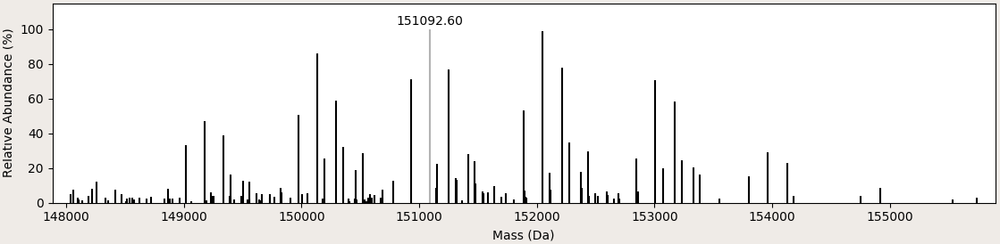

.. |bt_insert_row_below| image:: ../images/InsertRowBelow.png
                                 :scale: 50 %

.. |bt_load| image:: ../images/Open.png
                     :scale: 50 %
.. |bt_load_default| image:: ../images/DefaultEntries.png
                             :scale: 50 %

********
Workflow
********

The layout of ModFinder's main window encourages the following workflow:

1. Load a *sequence* in FASTA format.
2. Specify a list of *modifications* for the composition search.
3. Specify a *glycan library* for the structure search (optional).
4. Load a *mass spectrum*.
5. Perform the *search* and analyze its results.

.. _load-seq:

===================================
(1) Load a sequence in FASTA format
===================================

Click |bt_load| *Load sequence*  to load the sequence (in FASTA format) of the protein to be analyzed. Alternatively, paste the sequence into the editor. If the protein has multiple chains, each chain must be specified with its own header line, i.e., a line starting with ``>``. (The mass of one oxygen atom and two hydrogens will be added to the protein mass per chain.)

Enter the number of disulfide bonds. For each disulfide bond, the mass of two hydrogen atoms will be removed from the protein.

Specify whether the protein was treated with PNGase F. The asparagine residue in each N-glycosylation site (consensus sequence ``[ST]|N[^P][ST]``) will be mutated to aspartate, which corresponds to a mass change of N\ :sub:`–1`\ H\ :sub:`–1`\ O.

.. image:: images/sequence.png
           :alt: Sequence input
           :align: center

.. _mass-sets:

You can select different mass sets in the combobox below the protein sequence. ModFinder includes the following mass sets (see entries in file ``config/mass_sets.ini``):

* Average IUPAC masses (data from Meija, J. *et al.* Atomic weights of the elements 2013 (IUPAC Technical Report). *Pure Appl. Chem.* **88**\ (3), 265–291 (2016))
* Average masses for organic sources (data from Zhang, Z. *et al.* Mass spectrometry for structural characterization of therapeutic proteins. *Mass Spec. Rev.* **28**, 147–176 (2009))
* Average masses as used in *Thermo Fisher BioPharma Finder*
* Monoisotopic masses (data from Wang, M. *et al.* The Ame2012 atomic mass evaluation. (II). Tables, graphs and references. *Chin. Phys. C* **36**\ (12), 1603–2014 (2012))

ModFinder uses the selected atomic masses for calculating the mass of the protein, the mass of known modifications, and the total mass. These masses always appear in the left corner of the status bar.

Click |bt_save| *Save sequence* to save the contents of the sequence editor, |bt_clear| *Clear sequence* to clear its contents, and |bt_update| *Update masses* to update the masses in the status bar.

.. admonition:: Example
   :class: note
   
   Load the sequence of Kadcyla in ``sample data/1_kadcyla.fasta`` by clicking on |bt_load| *Load sequence* next to the sequence editor.

   The antibody comprises two light and two heady chains, which are labeled by FASTA headers (``>Light 1``, ``>Heavy 1``, ``>Light 2`` and ``>Heavy 2``). Enter the correct number of disulfides (16) in the spinbox.

   Using IUPAC average masses, the sequence has a molecular mass of 145199.44 Da. Including the mass of known modifications (i.e., the disulfide briges), which is –32.26 Da, the total mass of the protein is 145167.18 Da.

.. _mod-list:

==============================================================
(2) Specify a list of modifications for the composition search
==============================================================

Load modifications from a CSV or Excel file via |bt_load| *Load modifications*. A modification file must contain at least two columns labeled "Name" and "Composition". The remaining columns are optional; if missing, MoFi assumes the following default values: "Checked" (False), "Min" (0), and "Max" (inf).

Alternatively, click |bt_load_default| *Load default modifications → Monosaccharides and frequent modifications* to load a set of default modifications.

Save the current list of modifications to a CSV file via |bt_save| *Save modifications*.

.. image:: images/modification_table.png
           :alt: Table of modifications
           :align: center

The table of modifications contains the following columns:

  :Use?: Check the box for each modification that you want to include in the composition search.
  :Name: Modification names may include any Unicode character.
  :Formula: accepts either molecular formulas (as shown for Hex) or mass values in Da (as shown for DM1 and MCC). If you enter a formula and move the mouse cursor over the cell, a tooltip containing the mass of this formula appears. A molecular formula consists of space-separated ``symbol[count]`` pairs. ``symbol`` is any one- or two-letter atomic symbol whose mass is specified in the current mass set. The optional ``[count]`` is a positive or negative integer. A symbol without count is counted once.
  :Min: the minimum …
  :Max: … and maximum number of occurrences, respectively. If the maximum count for a modification is *inf* (short for infinite), MoFi calculates it from the glycan library, the mass of the molecule or the value of the parameter ``maxmods`` in file ``config/config.ini``.

Manipulate the table via the buttons next to it:

  * |bt_insert_row_above| *Insert row above*
  * |bt_insert_row_below| *Insert row below*
  * |bt_delete_row| *Delete row*
  * |bt_clear_table| *Clear table*

.. admonition:: Example
   :class: note
   
   Load modifications from ``sample data/2_modifications.csv`` by clicking on |bt_load| *Load modifications* next to the table of modifications. In the case of Kadcyla, the combinatorial search requires the following modifications:

   :Hex, HexNAc, Neu5Ac, Fuc: Monosaccharides that form the N-glycans of the antibody moiety.
   :DM1: The drug emtansine, coupled to the antibody via a linker. Although its molecular formula is known (C\ :sub:`47` H\ :sub:`61` Cl N\ :sub:`4` O\ :sub:`13` S), we specified the average mass in order to demonstate MoFi's capability of handling both formulas and masses.
   :MCC: The linker maleimidylmethyl cyclohexane-1-carboxylate (C\ :sub:`12` H\ :sub:`15` O\ :sub:`3` N). We expect that Kadyla also contains 'dead' linkers without any attached drug molecule.

.. _glycan-library:

=====================================================
(3) Specify a glycan library for the structure search
=====================================================

Load a glycan library from a CSV or Excel file via |bt_load| *Load glycans*. ModFinder accepts Excel files with two different kinds of contents:

* A *plain* Excel file (and also a CSV file) must contain at least two columns labeled "Name" and "Composition". The remaining columns are optional; if missing, MoFi assumes the following default values: "Checked" (True), "Sites" (empty), and "Abundance" (0.0).
* An Excel file as exported from *Thermo Fisher BioPharma Finder* must contain a column labeled "Modification", from which MoFi calculates the name, the composition and the site of each glycan. Columns "Checked" and "Abundance" are optional (as above).

Alternatively, click |bt_load_default| *Load default glycans → Default mAB glycans* to load a default glycan library.

Save the current list of glycans to a CSV file via |bt_save| *Save glycans*.

.. image:: images/glycan_table.png
           :alt: Table of glycans
           :align: center

The table of glycans contains the following columns:

  :Use?: Check the box for each glycan that you want to include in the structure search.
  :Composition: accepts a comma-separated list of modifications, all of which must appear in the table of modifications.
  :Sites: accepts a comma-separated list of glycosylation sites.
  :Abundance: may contain relative abundances as determined, e.g., by peptide mapping. MoFi calculates the score of a glycan combination from these values.

Manipulate the table via the buttons next to it:

  * |bt_insert_row_above| *Insert row above*
  * |bt_insert_row_below| *Insert row below*
  * |bt_delete_row| *Delete row*
  * |bt_clear_table| *Clear table*

.. admonition:: Example
   :class: note
   
   Load the glycan library from ``sample data/3_glycan_library.csv`` by clicking on |bt_load| *Load glycans* next to the table of glycans. Note that MoFi also accepts unglycosylated sites (here, the structure 'no_glycan'). We arbitrarily named the glycosylation sites 'ch_A' and 'ch_B', but any other name will also work.

   Alternatively, load the glycan library in ``sample data/3_glycan_library_BPF.xls``. This file contains the results of a peptide mapping analysis in Thermo BioPharma Finder and was directly exported from this program. ModFinder automatically extracts the name of the glycoslation site (here, 'N300') and the glycan composition from the column 'Modification' in the XLS file. (For instance, the abbreviation 'A2S1G1F' denotes a glycan comprising 5 Hex, 4 HexNAc, 1 Neu5Ac and 1 Fuc. Refer to the BioPharma Finder manual for an explanation of these abbreviations.)

   NB: Since each heavy chain harbors a glycosylation site at N300, you have to change the values in column 'Site' of the table of glycans to 'ch_A, ch_B' or similar.

.. _spectrum:

========================
(4) Load a mass spectrum
========================

Click |bt_load| *Load mass list* to load a peak list (in CSV or Excel format) that represents a mass spectrum. The file must contain at least one column labeled "Average Mass" or "Average Mass (mean)". If a column labeled "Relative Abundance" is present, MoFi will interpret its values as peak heights.

Click |bt_save| *Save spectrum* to save an image of the spectrum in a range of file formats (e.g., jpg, pdf, png, …).

|bt_label_peaks| *Label peaks* turns labels (peak masses) on or off.

If |bt_select_peaks| *Select peaks* is active, you may interact with the spectrum by

* Clicking onto a single peak with the left mouse button, which highlights that peak.
* Dragging with the left mouse button, which selects a range of peaks.
* Dragging a line or rectangle with the right mouse button, which zooms into the selected region of the spectrum. |bt_reset_zoom| *Reset zoom* shows the entire spectrum.

.. _delta-series:

|bt_select_delta_series| *Select delta series* enters delta series selection mode: Select a single peak to mark it as the main peak (highlighted in red). All peaks that are separated from the main peak by equal distances are highlighted in yellow. The main peak is numbered 0, the other peaks in the series are consecutively numbered 1, 2, … (increasing masses) and –1, –2, … (decreasing masses).

.. image:: images/delta_series.png
           :alt: Delta series
           :align: center
 
You can display up to two delta series simultaneously by checking the boxes *1* and *2* to the right of the spectrum. The peaks in the second series are highlighted in blue. For each series, you may set the following parameters:

* Mass differences between neighboring peaks
* Tolerance of the mass differences
* Maximum repetitions (i.e., the maximum number of labeled peaks on each side of the main peak)

.. image:: images/delta_series_parameters.png
           :alt: Delta series parameters
           :align: center

It is also possible to combine the delta series (check button *Combine*). In this case, the second delta series will start at each peak in the first delta series.

.. image:: images/delta_series_combined.png
           :alt: Combining delta series
           :align: center

The following table summarizes the color scheme for delta series:

.. admonition:: Example
   :class: note
   
   Load the mass spectrum of Kadcyla from ``sample data/4_spectrum.csv`` or ``sample date/4_spectrum.xls`` by clicking on |bt_load| *Load mass list* next to the delta series parameters.

   Apparently, the spectrum contains group of peaks whose largest peaks are separated by equal masses. Highlight those peaks by clicking |bt_select_delta_series| *Select delta series* and choosing the following parameters for series 1: Mass difference, 957.53 Da (i.e., one DM1 molecule); tolerance: 5.00 Da; maximum repetitions: auto.

   Within each group, the major peaks also differ by equal masses. Highlight those peaks by activating the second delta series, entering a mass difference of 162.14 Da (i.e., one hexose) and two maximum repetitions, and finally checking *Combine*.

.. _perform-search:

======================
(5) Perform the search
======================

.. image:: images/search_parameters.png
           :alt: Search parameters
           :align: center

Click onto *Find modifications* to start the composition search, possibly followed by the structure search if you specified a list of glycans in step 3.

You may analyze either all peaks in the spectrum or a single mass.

The tolerance for acceptable annotations can be given in Da or ppm.

.. admonition:: Example
   :class: note
   
   Search for modifications in Kadcyla by clicking *Find modifications*.

========
Settings
========

* *Save settings …* (Ctrl+S) saves the current settings (sequence, list of modifications, glycan library, spectrum) as an XML file.
* *Load settings …* (Ctrl+O) loads settings from a previously generated XML file.
* *Quit* (Ctrl+Q) closes ModFinder.
