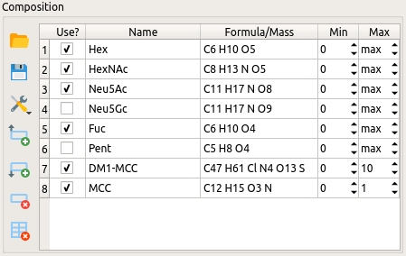
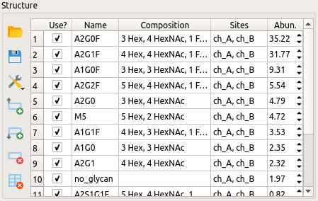

********
Workflow
********

(1) Load a sequence in FASTA format
===================================

Select *File -> Open FASTA file* (Ctrl+F) to load the sequence of your target protein in FASTA format. Alternatively, paste the sequence into the editor. If the protein has multiple chains, each chain must be specified with its own header line, i.e., a line starting with ">". (The mass of one oxygen atom and two hydrogens will be added to the protein mass per chain.)

Enter the number of disulfide bonds (H\ :sub:`–2` per disulfide).

Specify whether the protein was treated with PNGase F (N\ :sub:`–1`\ H\ :sub:`–1`\ O\ :sub:`1` for each N-glycosylation site).

.. image:: images/sequence.png
           :alt: Sequence input
           :align: center

(2) Load a mass spectrum
========================

Select *File -> Open peak file* (Ctrl+P) to load the spectrum. MoFi supports peak lists in both CSV and Excel format. The file must contain at least one column labeled "Average Mass" or "Average Mass (mean)". If a column labeled "Relative Abundance" is present, its values will be used for the peak heights. After the spectrum has been loaded, it will be drawn in the center of the window:

.. image:: images/loaded_spectrum.png
           :alt: Loaded spectrum
           :align: center

.. rubric:: Navigation tools

* Clicking onto a single peak with the left mouse button selects that peak (it will be highlighted in yellow). 
* Dragging with the left mouse button selects a range of peaks.
* Dragging a line or rectangle with the right mouse button zooms into the selected region of the spectrum.
* You can also select one or more peaks via the mass list.

.. image:: images/masslist.png
           :alt: Mass list
           :align: center

* The button *Reset zoom* shows the complete spectrum.
* The button *Label peaks* turns labels on/off.
* The button *Select delta series* enters delta series selection mode: Select a single peak to highlight this peak (red) and all peaks that are separated from the main peak by equal distances (violet). The main peak is numbered 0, the other peaks in the series are consecutively numbered 1, 2, … (increasing masses) and –1, –2, … (decreasing masses).

.. image:: images/delta_series.png
           :alt: Delta series
           :align: center
 
You can display up to two delta series simultaneously (check buttons to the right). For each series, you may set the following parameters:

* Mass difference between neighboring peaks
* Mass tolerance
* Maximum repetitions (i.e., the maximum number of labeled peaks on each side of the main peak)

.. image:: images/delta_series_parameters.png
           :alt: Delta series parameters
           :align: center

It is also possible to combine the delta series (check button *Combine*). In this case, the second delta series will start at each peak in the first delta series.

.. image:: images/delta_series_combined.png
           :alt: Combining delta series
           :align: center

(3) Specify a list of modifications for the composition search
==============================================================

Modifications can be loaded from a CSV or Excel file via Load modifications. A modification list must contain at least two columns labeled "Name" and "Composition". The remaining columns are optional; if missing, the following default values will be used: "Checked" (False), "Min" (0), and "Max" (–1). Alternatively, a set of default modifications is available under *Load default modifications -> Monosaccharides and frequent modifications*.

* Check the column *Use?* if you want to include a modification in the composition search.
* The names in column *Name* should only contain letters, digits and underscores, and must not start with a digit. Otherwise, you will not be able to apply a filter to the results table (see below).
* The column *Formula* accepts either molecular formulas (as shown for Hex) or mass values in Da (as shown for DM1 and MCC above). If you enter a formula and move the mouse cursor over the cell, the mass of this formula is shown as tooltip. If the maximum count for a modification is *inf* (short for infinite), it will be calculated automatically from the glycan library, the mass of the molecule or the value of the parameter maxmods in file ``config/config.ini``.

* The table may be manipulated via the top four buttons next to it (insert or delete rows, clear the whole table). The current list of modifications can be saved to a CSV file via *Save modifications*.

You can select different mass sets via *Options -> Atomic masses*. Currently, the following mass sets are included (see entries in file ``config/mass_sets.ini``):

* Average IUPAC masses (data from Meija, J. *et al.* Atomic weights of the elements 2013 (IUPAC Technical Report). *Pure Appl. Chem.* **88**\ (3), 265–291 (2016))
* Average masses for organic sources (data from Zhang, Z. *et al.* Mass spectrometry for structural characterization of therapeutic proteins. *Mass Spec. Rev.* **28**, 147–176 (2009))
* Average masses as used in Thermo Fisher BioPharma Finder
* Monoisotopic masses (data from Wang, M. *et al.* The Ame2012 atomic mass evaluation. (II). Tables, graphs and references. *Chin. Phys. C* **36**\ (12), 1603–2014 (2012))

(4) Specify a glycan library for the structure search
=====================================================

Glycans can be loaded via Load glycans from

(a) a CSV or Excel file. A glycan list must contain at least two columns labeled "Name" and "Composition". The remaining columns are optional; if missing, the following default values will be used: "Checked" (True), "Sites" (empty), and "Abundance" (0.0).
(b) an Excel file as exported from Thermo Fisher BioPharma Finder. Such a file must contain a column labeled "Modification", from which the name, the composition and the site of each glycan are calculated. Columns "Checked" and "Abundance" are optional (as above).

Alternatively, a set of default glycans is available under *Load default glycans -> Default mAB glycans*.

* Check the column *Use?* if you want to include a glycan in the structure search.
* The column *Composition* accepts a comma-separated list of modifications, which must appear under the same name in the list of modifications.
* The column *Sites* accepts a comma-separated list of sites where a glycan may appear.
* The column *Abundance* may contain a relative abundance as determined, e.g., in a bottom-up experiment. These abundances will be used for calculating the overall abundance of a glycan combination.

The table may be manipulated via the top four buttons next to it (insert or delete rows, clear the whole table). The current list of glycans can be saved to a CSV file via Save glycans.

(5) Perform the searches
========================

.. image:: images/search_parameters.png
           :alt: Search parameters
           :align: center

* Click onto *Find modifications* to start the composition search, possibly followed by the structure search if you specified a list of glycans in step 4.
* You may analyze either all peaks in the spectrum or a single mass.
* The tolerance for acceptable combinations of modifications can be given in Da or ppm.
