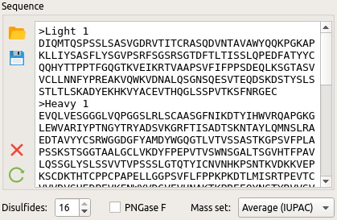
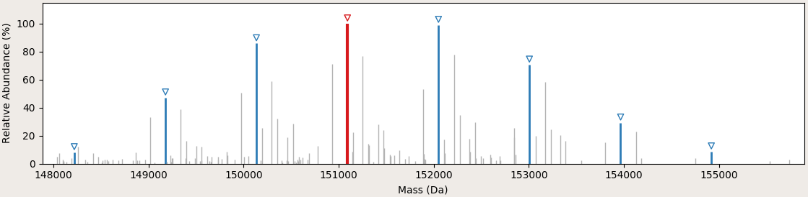

.. |bt_insert_row_above| image:: images/bt_insert_row_above.png
.. |bt_insert_row_below| image:: images/bt_insert_row_below.png
.. |bt_clear_table| image:: images/bt_clear_table.png
.. |bt_delete_row| image:: images/bt_delete_row.png
.. |bt_load| image:: images/bt_load.png
.. |bt_load_default| image:: images/bt_load_default.png
.. |bt_save| image:: images/bt_save.png

********
Workflow
********

(1) Load a sequence in FASTA format
===================================

Select *File → Open FASTA file* (Ctrl+F) to load the sequence (in FASTA format) of the protein to be analyzed. Alternatively, paste the sequence into the editor. If the protein has multiple chains, each chain must be specified with its own header line, i.e., a line starting with ``>``. (The mass of one oxygen atom and two hydrogens will be added to the protein mass per chain.)

Enter the number of disulfide bonds. For each disulfide bond, the mass of two hydrogen atoms will be removed from the protein.

Specify whether the protein was treated with PNGase F. The asparagine residue in each N-glycosylation site (consensus sequence ``[ST]|N[^P][ST]``) will be mutated to aspartate, which corresponds to a mass change of N\ :sub:`–1`\ H\ :sub:`–1`\ O.

(2) Load a mass spectrum
========================

Select *File → Open peak file* (Ctrl+P) to load the spectrum. MoFi supports peak lists in both CSV and Excel format. The file must contain at least one column labeled "Average Mass" or "Average Mass (mean)". If a column labeled "Relative Abundance" is present, its values will be used for the peak heights. After the spectrum has been loaded, it will be drawn at the center of the window:

.. image:: images/loaded_spectrum.png
           :alt: Loaded spectrum
           :align: center

* Clicking onto a single peak with the left mouse button selects that peak (it will be highlighted in yellow). 
* Dragging with the left mouse button selects a range of peaks.
* Dragging a line or rectangle with the right mouse button zooms into the selected region of the spectrum.
* You can also select one or more peaks via the mass list.

.. image:: images/masslist.png
           :alt: Mass list
           :align: center

* The button *Reset zoom* shows the complete spectrum.
* The button *Label peaks* turns labels on/off.
* The button *Select delta series* enters delta series selection mode: Select a single peak to mark it as the main peak (highlighted in red). All peaks that are separated from the main peak by equal distances are highlighted in violet. The main peak is numbered 0, the other peaks in the series are consecutively numbered 1, 2, … (increasing masses) and –1, –2, … (decreasing masses).

 
You can display up to two delta series simultaneously (check buttons *1* and *2* to the right of the spectrum). For each series, you may set the following parameters:

* Mass differences between neighboring peaks
* Tolerance of the mass differences
* Maximum repetitions (i.e., the maximum number of labeled peaks on each side of the main peak)

It is also possible to combine the delta series (check button *Combine*). In this case, the second delta series will start at each peak in the first delta series.

(3) Specify a list of modifications for the composition search
==============================================================

.. image:: images/modification_table.png
           :alt: Table of modifications
           :align: center

Load modifications from a CSV or Excel file via |bt_load| *Load modifications*. A modification file must contain at least two columns labeled "Name" and "Composition". The remaining columns are optional; if missing, MoFi assumes the following default values: "Checked" (False), "Min" (0), and "Max" (inf). Alternatively, a set of default modifications is available from |bt_load_default| *Load default modifications → Monosaccharides and frequent modifications*.

* Check the column *Use?* for each modification that you want to include in the composition search.
* The names in column *Name* should only contain letters, digits and underscores, and must not start with a digit. Otherwise, you will not be able to use those modifications for filtering the results table (see below).
* The column *Formula* accepts either molecular formulas (as shown for Hex) or mass values in Da (as shown for DM1 and MCC). If you enter a formula and move the mouse cursor over the cell, a tooltip containing the mass of this formula appears. A molecular formula consists of space-separated ``symbol[count]`` pairs. ``symbol`` is any one- or two-letter atomic symbol whose mass is specified in the current mass set. The optional ``[count]`` is a positive or negative integer. A symbol without count is counted once.
* The columns *Min* and *Max* specify the minimum and maximum number of occurrences, respectively. If the maximum count for a modification is *inf* (short for infinite), MoFi calculates it from the glycan library, the mass of the molecule or the value of the parameter ``maxmods`` in file ``config/config.ini``.
* The table may be manipulated via the buttons next to it:

  * |bt_insert_row_above| *Insert row above*
  * |bt_insert_row_below| *Insert row below*
  * |bt_delete_row| *Delete row*
  * |bt_clear_table| *Clear table*

* The current list of modifications can be saved to a CSV file via |bt_save| *Save modifications*.

You can select different mass sets via *Options → Atomic masses*. Currently, the following mass sets are included (see entries in file ``config/mass_sets.ini``):

* Average IUPAC masses (data from Meija, J. *et al.* Atomic weights of the elements 2013 (IUPAC Technical Report). *Pure Appl. Chem.* **88**\ (3), 265–291 (2016))
* Average masses for organic sources (data from Zhang, Z. *et al.* Mass spectrometry for structural characterization of therapeutic proteins. *Mass Spec. Rev.* **28**, 147–176 (2009))
* Average masses as used in *Thermo Fisher BioPharma Finder*
* Monoisotopic masses (data from Wang, M. *et al.* The Ame2012 atomic mass evaluation. (II). Tables, graphs and references. *Chin. Phys. C* **36**\ (12), 1603–2014 (2012))

(4) Specify a glycan library for the structure search
=====================================================

.. image:: images/glycan_table.png
           :alt: Table of glycans
           :align: center

|bt_load| *Load glycans* from

(a) a CSV or Excel file. A glycan file must contain at least two columns labeled "Name" and "Composition". The remaining columns are optional; if missing, MoFi assumes the following default values: "Checked" (True), "Sites" (empty), and "Abundance" (0.0).
(b) an Excel file as exported from *Thermo Fisher BioPharma Finder*. Such a file must contain a column labeled "Modification", from which MoFi calculates the name, the composition and the site of each glycan. Columns "Checked" and "Abundance" are optional (as above).

Alternatively, a set of default glycans is available from |bt_load_default| *Load default glycans → Default mAB glycans*.

* Check the column *Use?* for each glycan that you want to include in the structure search.
* The column *Composition* accepts a comma-separated list of modifications, all of which must appear in the table of modifications.
* The column *Sites* accepts a comma-separated list of sites where a glycan may appear.
* The column *Abundance* may contain relative abundances as determined, e.g., in a peptide mapping analysis. MoFi calculates the overall abundance of a glycan combination from those values.
* The table may be manipulated via the buttons next to it:

  * |bt_insert_row_above| *Insert row above*
  * |bt_insert_row_below| *Insert row below*
  * |bt_delete_row| *Delete row*
  * |bt_clear_table| *Clear table*

* The current list of glycans can be saved to a CSV file via |bt_save| *Save glycans*.

(5) Perform the search
======================

* Click onto *Find modifications* to start the composition search, possibly followed by the structure search if you specified a list of glycans in step 4.
* You may analyze either all peaks in the spectrum or a single mass.
* The tolerance for acceptable annotations can be given in Da or ppm.
